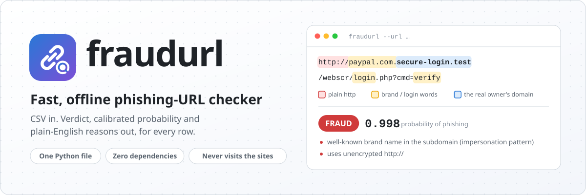
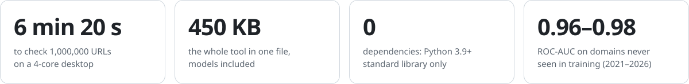
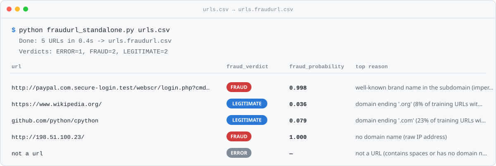
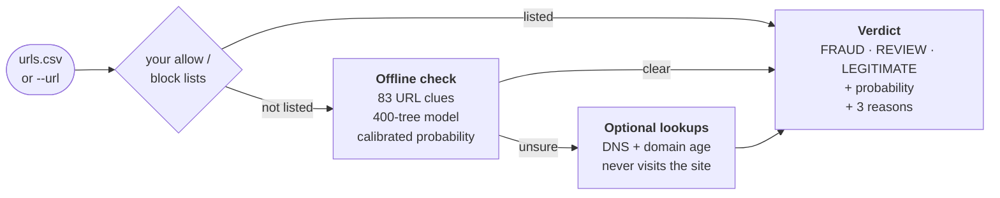
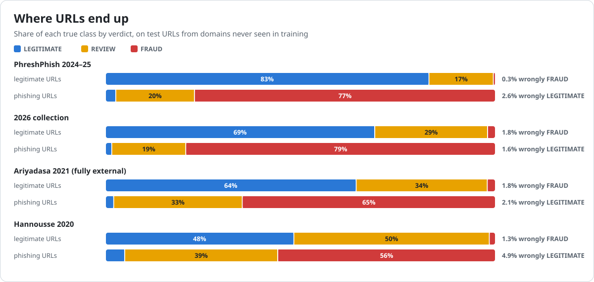

<div align="center">

<picture>
  <source media="(prefers-color-scheme: dark)" srcset="docs/assets/hero-dark.svg">
  
</picture>

<br>

[](https://github.com/amruth112/fraudurl-detector/actions/workflows/ci.yml)
[](LICENSE)


**[Quick start](#quick-start)** · **[How it works](#how-it-works)** · **[Accuracy](#how-accurate-is-it)** ·
**[Usage](#usage)** · **[Limitations](#limitations)** · **[Plain-English guide](HOW_IT_WORKS.md)** ·
**[Report](REPORT.md)** · **[Model card](MODEL_CARD.md)**

</div>

<br>

<picture>
  <source media="(prefers-color-scheme: dark)" srcset="docs/assets/stats-dark.svg">
  
</picture>

## What it does

Give **fraudurl** a CSV of links. It returns the same CSV with three things added to every row:
- a verdict: `FRAUD`, `LEGITIMATE`, or `REVIEW` when the address alone is not conclusive;
- a calibrated probability;
- the three plain-English reasons behind the verdict.

It judges the **URL itself**, using 83 clues such as a brand in the wrong place, login or payment words,
free-hosting addresses, risky domain endings, `http://` and random-looking names. It never opens the website.

<picture>
  <source media="(prefers-color-scheme: dark)" srcset="docs/assets/demo-dark.svg">
  
</picture>

- **One file, no dependencies.** The whole tool, models included, is one ~450 KB Python file that runs on the
  Python 3.9+ standard library.
- **Fast.** It checks about 1,000 URLs a second per CPU core, with flat memory (about 230 MB on 4 cores).
- **Explains itself.** The reasons are the model's own per-feature contributions, not a separate heuristic.
- **Says when it is unsure.** Ambiguous URLs go to `REVIEW` for a person instead of being guessed.
- **Private by default.** Offline mode never touches the network. The optional lookups ask DNS and the domain
  registry about the domain, never the website.

## Quick start

**Option 1: the single file.**
1. Download [`fraudurl_standalone.py`](fraudurl_standalone.py). Every
   [release](https://github.com/amruth112/fraudurl-detector/releases) also attaches it with a SHA256
   checksum.
2. Run:

```bash
python fraudurl_standalone.py my_urls.csv          # writes my_urls.fraudurl.csv
```

**Option 2: install the package.**

```bash
pip install git+https://github.com/amruth112/fraudurl-detector
fraudurl my_urls.csv
fraudurl --url "http://paypal.com.secure-login.test/webscr/login.php" --quiet   # one URL -> JSON
```

Both give identical results. CI checks this on every change, on Linux, macOS and Windows.

## How it works



1. **Read the URL the way a browser does.** It splits off tricks such as `paypal.com.` in the subdomain and
   uses the Public Suffix List to find the domain someone actually bought, `secure-login.test` in the example.
2. **Measure 83 clues.** These cover structure, character mix, randomness, redirect tricks, brand and login
   words, free-hosting platforms, and the phishing history of the domain ending.
3. **Score.** A 400-tree gradient-boosted model, trained with LightGBM and exported to JSON, runs in about
   60 lines of plain Python. Its score is calibrated into a probability, and two cut-offs turn that into a
   verdict.
4. **Explain.** Each tree's contribution is credited to the clue it used, and the three biggest become the
   reasons.
5. **Optionally look closer.** For unsure URLs, DNS records and the domain's registration age feed a second
   model that corrects the score.

The step-by-step version, with a worked example, is in [HOW_IT_WORKS.md](HOW_IT_WORKS.md).

## How accurate is it?

Every number here is measured on test URLs from **domains the model never saw in training**, across four
independently collected datasets from 2020 to 2026.

<picture>
  <source media="(prefers-color-scheme: dark)" srcset="docs/assets/verdicts-dark.svg">
  
</picture>

| Test data | ROC-AUC | Caught at 1% false alarms | Legitimate called FRAUD | Phishing called LEGITIMATE | Sent to REVIEW |
|---|---|---|---|---|---|
| PhreshPhish 2024–25 | 0.984 | 85% | 0.3% | 2.6% | 18% |
| 2026 collection | 0.975 | 73% | 1.8% | 1.6% | 24% |
| Ariyadasa 2021 (fully external) | 0.958 | 58% | 1.8% | 2.1% | 33% |
| Hannousse 2020 | 0.907 | 51% | 1.3% | 4.9% | 45% |

* **Good at:** clearing ordinary URLs, catching classic phishing patterns, and handing the ambiguous rest to a
  person.
* **Weaker on unfamiliar data:** older or very different data is harder.
* **Low-prevalence traffic:** when phishing is rare in your traffic, many FRAUD rows will be false alarms, so
  use `--base-rate`.
* **More detail:** [MODEL_CARD.md](MODEL_CARD.md) and the full [engineering report](REPORT.md), which
  includes a comparison with the Laya language model, 94–583× slower per URL here.

## Usage

```bash
fraudurl input.csv                         # offline mode, auto-detects the URL column
fraudurl input.csv -o results.csv
fraudurl input.csv --url-column "Website"  # pick the column explicitly
fraudurl input.csv --enrich-review         # DNS + registration lookups, only for REVIEW rows (recommended)
fraudurl input.csv --enrich                # DNS + registration lookups for every URL (slowest)
fraudurl input.csv --block-list block.txt --allow-list allow.txt   # your own decisions win
fraudurl input.csv --base-rate 0.02        # re-weight probabilities for ~2% expected fraud
fraudurl --url https://example.com/login --enrich-review   # one URL -> one JSON line on screen
fraudurl input.csv --format json           # JSON Lines file (input.fraudurl.jsonl)
fraudurl input.csv -o -                    # write the CSV to the screen (stdout)
fraudurl input.csv --workers 1             # worker processes (default: up to 4)
fraudurl input.csv --enrich-review --cache-dir ./my_cache   # where lookups are cached (default ./.fraudurl_cache)
```

`python fraudurl_standalone.py …` accepts exactly the same options.

<details>
<summary><b>Input files</b></summary>

* **URL column:** found from its header (`url`, `link`, `website`, ...). In a file with no header, the column
  whose values look most like URLs is used. `--url-column` overrides the choice.
* **Separators:** comma, semicolon, tab or pipe.
* **Encodings:** UTF-8 (with or without BOM), UTF-16 with BOM, and Windows-1252.
* **Large files:** streamed in chunks and scored in parallel. In offline mode memory stays flat.

</details>

<details>
<summary><b>Output columns</b></summary>

All original columns and the original row order are kept. These are added:

| column | meaning |
|---|---|
| `fraud_verdict` | `FRAUD`, `LEGITIMATE`, `REVIEW` (the URL text alone is not conclusive) or `ERROR` (not a URL) |
| `fraud_probability` | calibrated probability that the URL is phishing |
| `verdict_confidence` | Depends on the verdict: <br>• FRAUD: `fraud_probability` <br>• LEGITIMATE: `1 - fraud_probability` <br>• REVIEW: shows only which way the URL leans, e.g. 0.75 on a row with probability 0.25 means "leans legitimate, not enough to decide" |
| `top_reasons` | up to three signals that pushed the decision, in plain English |
| `registrable_domain` | the domain the URL really belongs to (e.g. `paypal.com.evil.test` → `evil.test`) |
| `analysis_mode` | How the row was checked, not a verdict: <br>• `offline (URL text only)` <br>• with lookups: `enriched (URL + DNS + RDAP)` or `offline (enrichment unavailable for this URL)` <br>• with `--enrich-review`, clear rows: `offline (URL text only; clear without lookups)` <br>• rows decided by your lists: `your block list` / `your allow list` |
| `lookup_status` | with lookups: what the DNS / registry lookups returned, or why they were skipped |
| `error` | why a row could not be scored |

</details>

<details>
<summary><b>Lookups: <code>--enrich-review</code> or <code>--enrich</code></b></summary>

Every URL first gets the offline check. Then:

* **`--enrich-review`** looks up only the URLs left in `REVIEW` (DNS + domain registration). That is where
  lookups matter most.
* **`--enrich`** looks up every URL.

On live 2026 phishing domains outside shared hosting platforms, lookups raised the share caught at a 1%
false-alarm rate from 43% to 58%.

Lookups are limited to about 2 per second per domain registry:
* on 1,000,000 URLs, `--enrich` is estimated at 16–19 hours and `--enrich-review` at about 7;
* small files take seconds to minutes;
* only `--enrich` sees the rare cases where lookups soften a FRAUD or LEGITIMATE verdict.

</details>

<details>
<summary><b>Your own allow and block lists</b></summary>

`--block-list` and `--allow-list` (both repeatable) take plain text files, one entry per line. `#` starts a
comment line, and anything after the first space is ignored, so you can add a note.

**Entries**
* `example.com` covers `example.com` and every subdomain, but not `notexample.com`.
* An entry with a path (`https://example.com/secure/`) covers that path and everything under it:
  * `/secure-verify` is not covered;
  * `../` tricks are resolved;
  * `*.example.com/secure/` does the same on every subdomain.
* IP addresses match in any spelling (`1.2.3.4`, `0x01020304`, `16909060`).
* Hosts-file lines (`0.0.0.0 evil.test`) are understood.
* Invalid lines are skipped with a warning.

**What a listed URL gets**
* `FRAUD` (block) or `LEGITIMATE` (allow), without lookups.
* `fraud_probability` and `verdict_confidence` are left empty, because this is your decision, not a model
  probability.
* `top_reasons` still shows what the model alone said.
* The block list always wins.

Do not allow-list shared platforms such as `google.com` or `github.io`: that would also allow phishing hosted
on them.

</details>

<details>
<summary><b>For pipelines: JSON output</b></summary>

`--url` (repeatable) and `--format json` write one JSON object per URL (JSON Lines):

```json
{"url": "...", "fraud_verdict": "REVIEW", "fraud_probability": 0.218, "verdict_confidence": 0.782,
 "top_reasons": ["..."], "registrable_domain": "...", "analysis_mode": "enriched (URL + DNS + RDAP)",
 "lookup_status": "dns=ok; rdap=ok", "error": null,
 "stages": {"offline_check": {"verdict": "REVIEW", "probability": 0.299},
            "lookups": {"dns": {"ipv4": ["..."], "nameservers": ["..."], "mail_servers": ["..."], "ttl_seconds": 3321},
                        "registration": {"registered": "1995-04-27T04:00:00Z", "expires": "...",
                                         "registrar": "...", "domain_age_days": 11477}}}}
```

(Some fields are omitted.)

* **`stages`** shows what each step found:
  * the offline check;
  * your list, if it decided;
  * the raw DNS and registration facts, if looked up.
* **Where output goes:** with `--url`, results go to stdout unless `-o` is given. Progress messages go to
  stderr, and `--quiet` silences them.
* **Other details:**
  * JSON output is ASCII-only.
  * File input with `--format json` also includes the original row as `input`.

</details>

<details>
<summary><b>What the verdicts and the probability mean</b></summary>

`fraud_probability` is a **calibrated** probability (Platt scaling fitted on held-out data), not a raw model
score. On URLs from domains the model never saw:

* **Where it is accurate:**
  * on a fully external 2021 dataset, URLs given ~0.25 were phishing 26% of the time, ~0.85 → 84%, and
    ≥0.95 → 99% (calibration error 0.012);
  * on 2026 data, ~0.24 → 24% and ~0.85 → 82% (error 0.016).
* **Where it is off:**
  * in the middle of the range (0.4–0.8), the 2026 numbers are over-confident by up to ~11 points
    (0.75 → 65%);
  * on 2020-era data, 11% of URLs scored below 0.05 were phishing, and they are called LEGITIMATE.
* **It assumes about half your URLs are phishing** (47%, the calibration balance).
  * If you expect far fewer, say so with `--base-rate`. A URL scored 0.97 is only ~27% likely to be phishing
    when 1% of all URLs are.
  * With `--base-rate`, a FRAUD or LEGITIMATE verdict is downgraded to REVIEW when the re-weighted
    probability falls on the other side of 0.5.

| verdict | rule (offline model) | rule (after lookups) |
|---|---|---|
| `FRAUD` | probability ≥ 0.873 | ≥ 0.923 |
| `LEGITIMATE` | probability ≤ 0.101 | ≤ 0.125 |
| `REVIEW` | in between | in between |

The thresholds were chosen on held-out calibration data to target about 1% of legitimate URLs called FRAUD
and 2% of phishing called LEGITIMATE.

</details>

<details>
<summary><b>Try it on the examples</b></summary>

```bash
python fraudurl_standalone.py examples/sample_urls.csv
```

`examples/sample_urls.csv` has:
* 15 legitimate held-out test URLs;
* 15 made-up phishing-style URLs: 14 on reserved domains (`.example`, `.test`, `example.com`, a
  documentation IP) and 1 Google Forms link with a placeholder ID;
* 5 edge cases.

`examples/sample_urls.fraudurl.csv` and `examples/sample_urls.enriched.fraudurl.csv` are the outputs.

</details>

## Limitations

* **Distribution shift.** Trained on one collection and tested on another, ROC-AUC fell to 0.85–0.96. If
  your URLs look very different from the training data, expect less.
* **Bare homepages** of popular sites mostly land in `REVIEW`: 76% of 1,000 Tranco top-10k homepages, and 3%
  were called FRAUD.
* **Shared platforms cut both ways.**
  * Phishing on Google Docs, Forms or Sites, or Weebly, can look legitimate. The Google Forms row (id 27) in
    `examples/sample_urls.fraudurl.csv` is called LEGITIMATE.
  * Honest sites on heavily abused free hosts (`pages.dev`, `webflow.io`) are often called FRAUD.
* **Other misses.** Hacked legitimate sites and carefully disguised URLs are hard to catch from the URL alone.
* **Ageing.** The model reflects 2020–2026 data and should be retrained periodically.

It is a fast **first-line filter** for triage, not a replacement for a full phishing-defence stack.

## Safety and privacy

* **Offline mode (the default) never touches the network.** Nothing leaves your computer.
* **`--enrich` / `--enrich-review` send some data out:**
  * host names go to Cloudflare's DNS-over-HTTPS resolver (1.1.1.1);
  * registrable domains go to the RDAP server of the domain's registry (at most 2 requests per second per
    registry);
  * IANA's RDAP bootstrap list is downloaded at most once every 30 days;
  * the path and query of your URLs are never sent.
* **Lookups never touch the site.** They never connect to the URL's web server, download pages or submit
  anything.
* **Lookup cache.** Results are cached in `./.fraudurl_cache/` (DNS for 7 days, registry data for 28 days),
  and several runs can share one cache folder.
* **Registry terms.** Some registries' terms restrict high-volume automated queries, so check before very
  large `--enrich` runs.
* **No keys or paid services.** No API keys, accounts or paid services are used.
* **Spreadsheet formulas.** Only the eight added columns are protected against formula injection. Your
  original cells are copied unchanged, so open output made from untrusted feeds with formulas disabled.

## Documentation

| | |
|---|---|
| [HOW_IT_WORKS.md](HOW_IT_WORKS.md) | plain-English guide: what you get, what to do with it, every step explained |
| [REPORT.md](REPORT.md) | the engineering report: data, experiments, what worked and what did not, all measurements |
| [MODEL_CARD.md](MODEL_CARD.md) | intended use, training data, evaluation, limitations |
| [experiments/README.md](experiments/README.md) | how the models were built and how to reproduce them |
| [CHANGELOG.md](CHANGELOG.md) | release notes |

## Repository layout

| path | what |
|---|---|
| `fraudurl_standalone.py` | the whole tool in one file, generated from `fraudurl/` (`experiments/build_single_file.py`) |
| `fraudurl/` | the tool as a Python package, plus `data/` (the two models and the Public Suffix List) |
| `tests/` | `python -m pytest -q` (offline, a few seconds) |
| `examples/` | sample input and outputs |
| `experiments/` | the research code: data collection, training, evaluation, the Laya comparison, benchmarks |
| `results/` | the measured numbers (JSON) and `SUMMARY.md`; per-URL outputs are not published |
| `docs/` | report template and the README images (generated by `experiments/make_readme_assets.py`) |

## Data, licences and credits

* The code and the trained models are released under the [MIT License](LICENSE).
* The bundled Public Suffix List is MPL-2.0 ([LICENSES/MPL-2.0.txt](LICENSES/MPL-2.0.txt)).
* The models were trained on the PhreshPhish (CC BY 4.0) and Hannousse (CC BY 4.0) datasets, plus 2026 URLs
  from PhishTank, the OpenPhish community feed, Hacker News links and Common Crawl.
* No training data is redistributed.

Full credits and citations are in [NOTICE.md](NOTICE.md) and [CITATION.cff](CITATION.cff).

## Contributing and security

Contributions are welcome; see [CONTRIBUTING.md](CONTRIBUTING.md). Report security problems privately, as
described in [SECURITY.md](SECURITY.md). Please never paste live phishing links into issues; defang them
(`hxxps://evil[.]example`).
